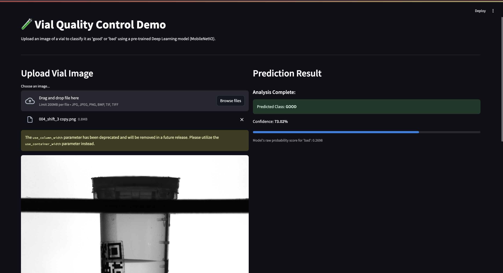

# Vial Quality Control Demo (Proof-of-Concept)

## Project Goal

This project is a proof-of-concept demonstrating the use of AI (specifically Deep Learning with Convolutional Neural Networks) for automated quality control of vials based on image analysis. It was inspired by an interview discussion regarding challenges in ensuring medical device readiness. The primary aim is to classify images of vials as either 'good' or 'bad' (anomalous).

## Demo Application

A simple web application built with Streamlit allows users to interact with the trained classification model.

**Functionality:**

* Upload an image file (jpg, png, bmp, tif) of a vial.
* The application displays the uploaded image.
* The trained TensorFlow/Keras model analyzes the image.
* The predicted classification ('good' or 'bad') and the model's confidence score are displayed.

**Screenshot:**


## How to Run Locally

Follow these steps to run the Streamlit demo application on your local machine:

1.  **Prerequisites:**
    * Python 3.8+
    * `pip` for package installation

2.  **Clone the Repository:**
    ```bash
    git clone [https://github.com/onyokoli/vial-quality-control-demo.git](https://github.com/onyokoli/vial-quality-control-demo.git)
    cd vial-quality-control-demo
    ```

3.  **Set up a Virtual Environment (Recommended):**
    ```bash
    python -m venv venv
    # On Windows:
    # venv\Scripts\activate
    # On macOS/Linux:
    # source venv/bin/activate
    ```

4.  **Install Dependencies:**
    ```bash
    pip install -r requirements.txt
    ```

5.  **Run the Streamlit App:**
    ```bash
    streamlit run app.py
    ```
    The application should open automatically in your web browser.

## Model Details

* **Approach:** Supervised Binary Classification ('good' vs. 'bad').
* **Dataset:** MVTec Anomaly Detection (MVTec AD) dataset - specifically the 'Vial' category (MVTec AD 2 structure).
* **Architecture:** Transfer Learning using a pre-trained **MobileNetV2** model (trained on ImageNet) as the base feature extractor. The base model's weights were frozen during training. A custom classification head was added on top, consisting of Global Average Pooling, Dropout (20%), and a final Dense layer with a Sigmoid activation.
* **Framework:** TensorFlow / Keras.
* **Training:** The classification head was trained for 11 epochs.
* **Performance (on Test Set):**
    * **Accuracy:** ~99.3%
    * **Precision:** 100.0% (No 'good' vials were incorrectly classified as 'bad')
    * **Recall:** ~99.1% (Found ~99% of the actual 'bad' vials)
    * **AUC:** 100.0% (Excellent class separability)

## Limitations

* **Data Sampling for Training:** This dataset (MVTec AD) is primarily designed for unsupervised anomaly detection (training only on 'good' samples). To demonstrate a *supervised classification* workflow within the limited timeframe of this project, 'bad' (anomaly) examples were sampled from the original test set partition and copied into the training and validation directories. This constitutes **data leakage** and means the reported test set performance might be optimistic compared to a rigorously separated dataset setup. This approach was taken strictly for demonstration purposes.
* **Focus:** This proof-of-concept focuses solely on the image classification aspect of the potential quality control system discussed.

## Conceptual Extensions (Future Work)

While this demo focuses on image classification, the concepts discussed in the interview involved a broader system. Potential next steps could include:

* **Multi-Modal Data Fusion:** Integrating analog sensor data (e.g., fill level sensors, weight) and discrete data (e.g., batch IDs) with the image model's predictions for a more robust classification.
* **Handling Big Data / Continuous Streams:** Implementing strategies for processing large volumes of incoming data efficiently (e.g., using stream processing frameworks like Kafka/Spark Streaming) and deploying the model for real-time inference.
* **Advanced Anomaly Detection:** Exploring unsupervised methods (like Autoencoders) trained only on 'good' data, which aligns better with the MVTec AD dataset's design and might be more robust to novel defect types.
* **Fine-tuning:** Unfreezing some layers of the base MobileNetV2 model and continuing training with a low learning rate could potentially yield further (though likely minor) performance improvements.

## Files in Repository

* `app.py`: The Streamlit application script.
* `vial_classifier.keras`: The saved, trained TensorFlow/Keras model.
* `requirements.txt`: Required Python packages to run the application.
* `README.md`: This file.
* `Vial_Defects.ipynb`:The notebook showing the data exploration, model training, and evaluation process.
* `streamlit_demo_good.jpg`: Screenshot of the app demo
